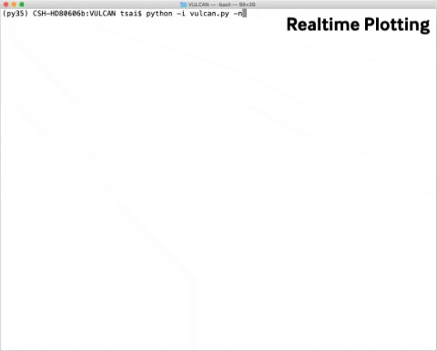

# VULCAN
#### Authors: Shang-Min (Shami) Tsai ####
[](https://www.gnu.org/licenses/gpl-3.0)\
Photochemical kinetics for exoplanetary atmospheres, a fast and easy-to-use python code.
VULCAN is implemented with the equilibrium chemistry code [FastChem](https://github.com/exoclime/FastChem)  created by Daniel Kitzmann, Joachim Stock, to initialise a state in chemical equilibrium.

The theory papers of VULCAN can be found here: [Tsai et al. 2021](https://arxiv.org/abs/2108.01790) (with photochemistry) and [Tsai et al. 2017](https://arxiv.org/abs/1607.00409) (without photochemistry).
This is currently a release candidate version. Any questions or feedbacks is welcome and can be sent to [Shami Tsai](mailto:shang-min.tsai@physics.ox.ac.uk)

* Running with realtime plotting:\

## Requirements
VULCAN is developed with Python 3 but has been tested compatible with Python 2.7. It is advised to run it on Python 3 if possible.
Two very useful tools to set up python environments:\
[Pip](https://pip.pypa.io/en/stable/) - package installer for Python\
[Anaconda](https://docs.continuum.io/) - virtual environment manager

VULCAN requires the following python packages:
- numpy
- scipy
- Sympy
- matplotlib
- PIL/Pillow (optional: for interactive plotting)
and the embeded [FastChem](https://github.com/exoclime/FastChem) requires a standard C++ compiler, like g++ or Clang.

If any of the python packages are missing, you can install the full SciPy Stack via Pip, e.g.
```bash
pip3 install --upgrade pip
```
```bash
pip3 install --user numpy scipy matplotlib ipython jupyter pandas sympy nose
```
The above commands update pip and install SciPy via pip (use pip instead of pip3 if running with python2). Further information can be found at http://www.scipy.org/install.html

PIL or Pillow is a plotting library. If installed, the plots will be conveniently shown by the os-built-in image viewer. See https://github.com/python-pillow/Pillow for more information.  

## Quick Demo

Let's dive in and see chemical kinetics in action!

First, go to the ```/fastchem_vulcan``` folder to compile [FastChem](https://github.com/exoclime/FastChem)(equilibrium chemistry code) by running
```
make
```

After compiling finished, go back to the main directory of VULCAN and run
```
python vulcan.py
```

You should see the default model for HD 189733b starts running with real-time plotting, how cool is that! This will take about 10-15 minutes to complete depending on your comuputer. Don't resist yourself from just staring at this live plotting -- it is almost like mindfulness meditation.

After the run finished with a steady state, we can plot the results from the output (stored in ```/output``` by default). Run the  plotting script ```plot_vulcan.py``` in the folder ```plot_py```, followed by three arguments: **{output path} {comma-separated species} {plotname}**. For example,
```
python plot_vulcan.py ../output/HD189.vul H2O,CH4,CO,CO2,NH3,HCN hd189
```
will plot the output file "HD189.vul" for the chosen species: H2O,CH4,CO,CO2,NH3,HCN and save the plot named "hd189" in the ```/plot``` folder.


Now you may want to try a different T-P input, changing the elemental abundances or vertical mixing. All these settings are prescreibed in ```vulcan_cfg.py```. For example, find and edit
```python
const_Kzz = 1.E7
```
and
```python
C_H = 6.0618E-4
```
for a weaker vertical mixing (K<sub>zz</sub>) and carbon rich (C/O=1) run. Set use_live_plot = False if you wish to switch off the real-time plotting (why whould you though?). More detailed instruction can be found in the following sections. Have fun!

## Full instruction

### Structure
```
├── VULCAN/
│   ├── atm/
│   ├── fastchem_vulcan/
│   ├── output
│   ├── plot/
│   ├── plot_py/
│   ├── /thermo/
│   │   ├──/NASA9/
│   │   ├── all_compose.txt
│   │   ├── gibbs_text.txt
│   ├── build_atm.py  
│   ├── chem_funs
│   ├── make_chem_funs.py
│   ├── op.py
│   ├── phy_const.py
│   ├── store.py
│   ├── vulcan.py
│   ├── vulcan_cfg.py
```

`/atm/`: storing input atmospheric files
`/fastchem_vulcan/`: Fastchem (equilibirum chemistry code) which is used to initialse the compositions
`/output/`: storing the output files
`/plot/`: storing the output plots
`/thermo/`: storing chemical kinetics networks and thermodynamic data
`/thermo/NASA9/`: storing the NASA-9 polynomials for the Gibbs free energy of every species
`/thermo/all_compose.txt`: basic compositional properties e.g. number of atoms and molecular weight
`/thermo/gibbs_text.txt`: a text file used by make_chem_funs.py to generate chem_funs.py
`build_atm.py`: modules to construct the atmospheric structure based on the input and to set up the initial compositions                
`chem_funs.py`: the functions of chemical sources/sinks, Jacobian matrix and the equilibrium constants    
`NCHO_photo_netowrk.txt`: the default N-C-H-O photochemical kinetics network  
`op.py`: all the modules for the numerical operations, e.g. computing reaction rates, ODE solvers etc.    
`make_chem_funs.py`: the routine that runs first to produce the required `chem_funs.py` based on the assigned chemical network    
`phy_const.py`: physical constants  
`store.py`: modules to store all the variables  
`vulcan.py`: the top-level main script of VULCAN  
`vulcan_cfg.py`: the configuration file for VULCAN  

Typically ```vulcan_cfg.py``` is the only file you need to edit for each specific run. If you want to look inside or modify the code, `store.py` is where almost all classes and variables are declared.  

### Configuration File ###
<strong>All the settings and parameters, e.g. the atmospheric parameters, the elemental abundance etc, are prescribed in ```vulcan_cfg.py```</strong>. Typically this is the only file you need to edit for each specific run. A useful cheatsheet describing what every parameter does can be found in ```vulcan_cfg_readme.txt```. The configuration files used for the model validation in [Tsai et al. 2021](https://arxiv.org/abs/2108.01790) are also provided in the cfg_examples folder.  

### Input Files
The key input files of VULCAN include the chemical network, atmospheric T-P profile, and stellar flux. ```NCHO_photo_network.txt``` is the deafult reaction network including nitrogen, carbon, hydrogen, and oxygen species. It is validated from ~ 500 to 3000 K with about 60 gaseous species and 700 reactions.
The rate coefficients A, B, C are written in A, B, C as in the Arrhenius formula k = A T^B exp(-C/T).
The input temperature-pressure(-Kzz) profile is required when Kzz_prof is set to 'file' in vulcan_cfg.py and is placed in the `/atm` folder by default. The first line in the T-P file is commented for units, and the second line must specifies the column names: **Pressure	Temp** or **Pressure	Temp  	Kzz** (Kzz is optional). So the file consists of two columns without K<sub>zz</sub> and three columns with K<sub>zz</sub>.
See the included T-P files of HD 189733b and HD 209458b in `/atm` for example.  
The stellar UV flux is stored in /atm/stellar_flux, with the first column being weavelength in nm and the second column	being flux in ergs/cm**2/s/nm.
The thermodynamics data and cross sections are stored in /thermo/NASA9 and /thermo/photo_cross, respectively. Change at your own risk!
If constant fluxes for certain species are used, the files are also placed in /atm, in the format of species, flux (cm-2 s-1), and deposite velocity (cm s-1).


### Editing or Using a different chemical network
VULCAN is developed in a flexible way that the chemical network is _not_ hard coded. Instead, ```make_chem_funs.py``` generates all the required funtions from the input chemical network (e.g. ```NCHO_photo_netowrk.txt```) into ```chem_funs.py```.
You can edit the default netowrk, to remove or add reactions, to change rate constats, etc. You can also use a different chemical network, as long as it is in the same format as the defalut ones. That is, the reactions should be writen in the form of [ A + B -> C + D ], including the square brackets.
By default, ```make_chem_funs.py``` is always called prior to the main code to produce ```chem_funs.py``` based on the new chemical network . This step (which takes a few seconds) can be skiped by adding the agument ```-n```while running vulcan in the command line:
```
python vulcan.py -n
```
However, it is important NOT to skipping this step after making a change of the chemical network.

Noted that changing or using a different chemical network is not foolproof -- unrealistic values could lead to numerical issues. You can also see that only the forward reactions are listed, since VULCAN reverses the forward reactions to obtain the reverse reactions using the thermodynamic data.
So next, make sure all the species are included in the ```NASA9``` folder. If not, they need to be added manually by looking over ```nasa9_2002_E.txt``` or ```new_nasa9.txt```, which can also be found in ```NASA9```. Save the coefficients in a text file with the same name as used in the network (e.g. CO2.txt). The format of the NASA 9 polynomials is as follows
```
a1 a2 a3 a4 a5
a6 a7 0. a8 a9
```
Here, a7 and a8 are separated by 0. The first two rows are for low temperature (200 - 1000 K) and the last two rows are for high temperature (1000 - 6000 K).\

The reaction number, i.e. **id**, is irrelevent as it will be automatically generated (and writing into the network file) while calling ```make_chem_funs```. Three-body or dissociation reactions should also be separately listed after the comment line as the default network.
After changing the network, you can examine all the readable information, like the list of reactions and species in ```chem_funs.py```, being updated while running python vulcan.py (without -n argument).

### Boundary Conditions ###
If both use_topflux and use_botflux in vulcan_cfg.py are set to False, it will use the default boundary condition -- zero flux boundary i.e. nothing coming in or out. When use_topflux = True, it reads the file prescribed in top_BC_flux_file as the incoming/outgoing flux at the top boundary. Similarly, when use_botflux = True, the file prescribed in bot_BC_flux_file is read in for the surface pressure and sinks at the bottom boundary. In addition, you can also use the dictionary use_fix_sp_bot to set fixed mole fraction at the surface. e.g. use_fix_sp_bot = {'CO2': 0.01} sets the surface CO<sub>2</sub> mixing ratio to 0.01.

### Reading Output Files 	###
Run ```plot_vulcan.py``` within ```plot_py```
```
python plot_vulcan.py [vulcan output] [species] [plot name] [-h (for plotting height)]
``` 
will read vulcan output (.vul files) can plot the species profiles. Species should be sepreated by commas without space. Plot is in pressure by diffcult and can be changed to height by adding "-h".  

The script of ```plot_vulcan.py``` should also serve as a good example of how to access to output files. The first step is to use "pickle.load" to unpack the binary files. The main variables are stored in three basic classes: data['variable'], data['atm'], and data['parameter'].
You can also find all the names of variables and the class structure in ```store.py```.

### Troubleshooting ###
- `xcrun: error: invalid active developer path (/Library/Developer/CommandLineTools), missing xcrun at: /Library/Developer/CommandLineTools/usr/bin/xcrun`

Install the Xcode toolkit:
```
$ xcode-select --install
```


## Remarks
The project is financially support from the Center for Space and Habitability (CSH), the PlanetS NCCR framework and the Swiss-based MERAC Foundation.
The Exoclime Simulation Platform ([ESP][1]) develops a set of open-source codes
for research on exoplanets. The three parts of the ESP are
  - [HELIOS][2] radiative transfer and retrieval,
  - [THOR][3] atmospheric fluid dynamics,
  - [VULCAN][4] atmospheric chemistry,
  - [FastChem][5] equilibrium chemistry,
  - [HELA][6] random forest retrieval.

[1]: http://www.exoclime.net
[2]: https://github.com/exoclime/HELIOS
[3]: https://github.com/exoclime/THOR
[4]: https://github.com/exoclime/VULCAN
[5]: https://github.com/exoclime/FastChem
[6]: https://github.com/exoclime/HELA
